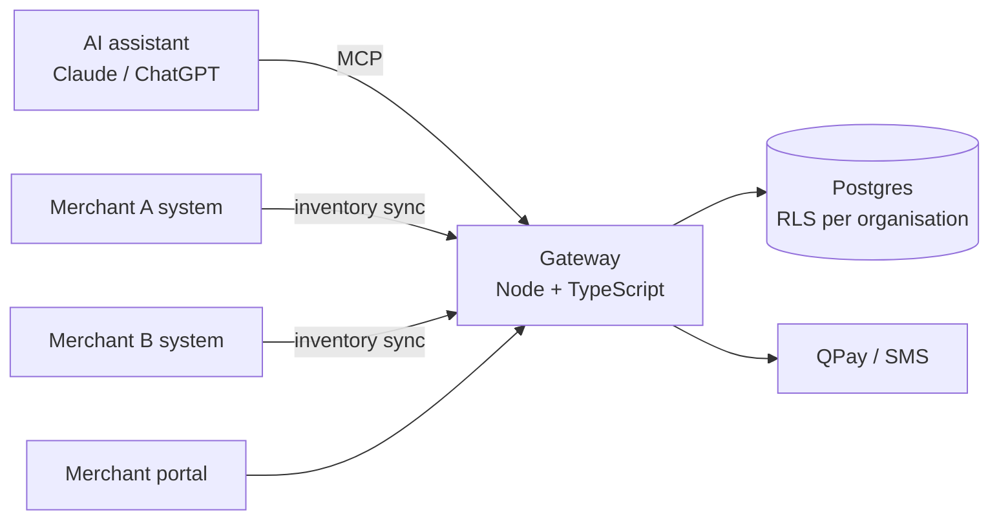

# Agentic Commerce Gateway — an MCP hub for local merchants

> "Find me winter tyres for a 2019 Prius, in stock in Ulaanbaatar, under ₮800k." An AI assistant asks the gateway; the gateway searches every connected merchant, checks live stock, and creates the order — with each merchant's data isolated from the others.

**Role:** solo builder · **Period:** Sep 2026 · **Status:** working on local infrastructure; 17 test suites green; next step is cart & checkout

---

## 1. The problem
Customers increasingly shop *through* AI assistants (Claude, ChatGPT, Gemini). Small merchants have no way to be found there — no MCP server, no product feed, no stock API. Building one per merchant does not scale.

## 2. What I built
One **multi-tenant MCP server** that any merchant can join:
- **Organisations & isolation** — every merchant is an organisation; isolation is enforced in the database with PostgreSQL **row-level security**, not in application code. A mis-configured query returns zero rows, never another merchant's data.
- **Self-service onboarding** — sign-up → verification → merchant portal; invitations with five permission levels
- **Catalogue** — products and variants, CSV import, inventory sync from the merchant's system (HTTP pull, push or manual) with freshness tracking
- **MCP tools** — `search_products`, `get_product`, `check_inventory`, order creation; per-organisation tool switches
- **Integrations page** — inventory, CRM and payment settings with secret masking and connection tests
- **Audit & compliance** — audit CLI, PII detection hooks, OAuth-protected endpoints
- **Decision records** — four ADRs document why the product is one hub for many merchants rather than one deployment each

### Architecture

## 3. Hard problems I solved
- **RLS that silently did nothing.** The Docker database role was a superuser, which bypasses row-level security. Found it with a dedicated tenancy test suite (20 checks) and introduced a non-privileged `app` role.
- **Orders without owners.** A regression test caught that `orders.user_id` was never set — fixed with proper session context.
- **Spec vs code drift.** Reconciled a 30-section product spec against the code and recorded conflicts as ADRs instead of silent choices.

## 4. Stack
Node.js · TypeScript · PostgreSQL (RLS) · Model Context Protocol · OAuth 2.1 · Docker · Caddy · n8n

---
*Source code is private. Live walkthrough available on request.* · Licence: CC BY-NC-ND 4.0
