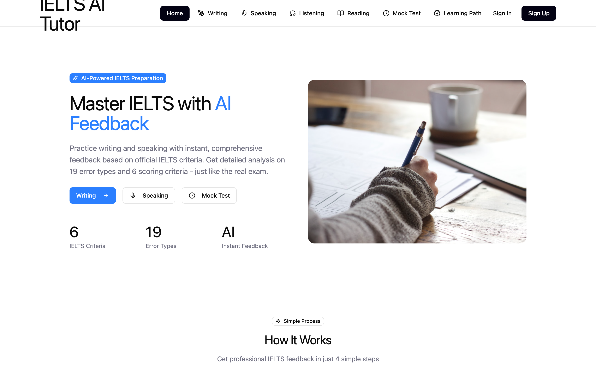
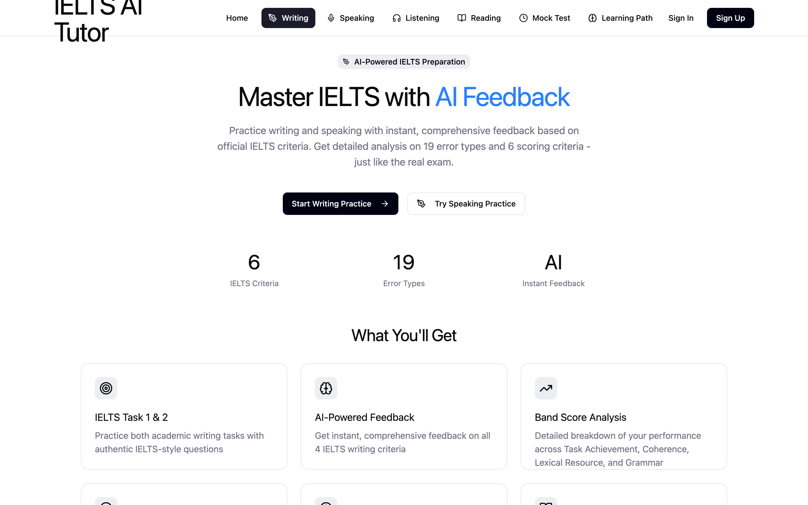
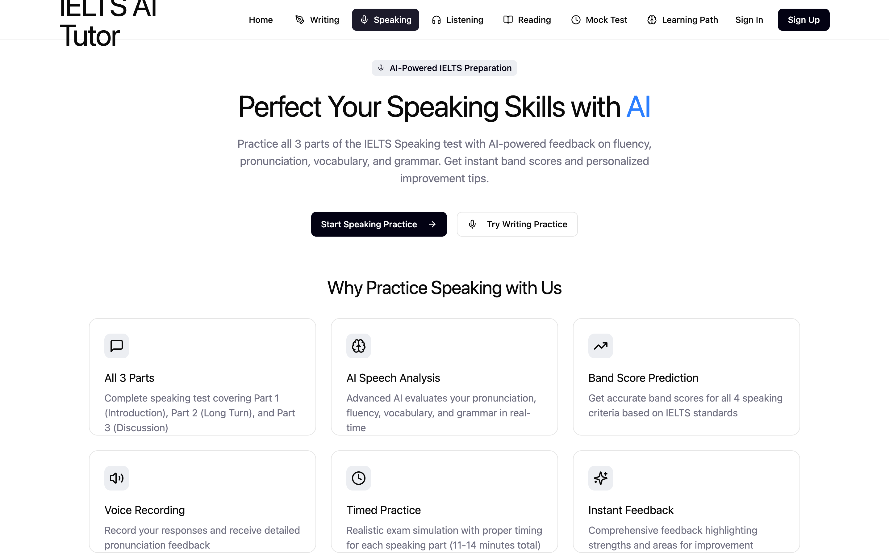
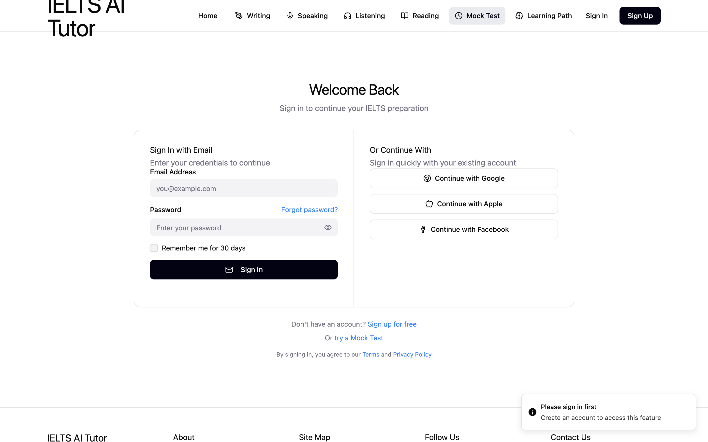
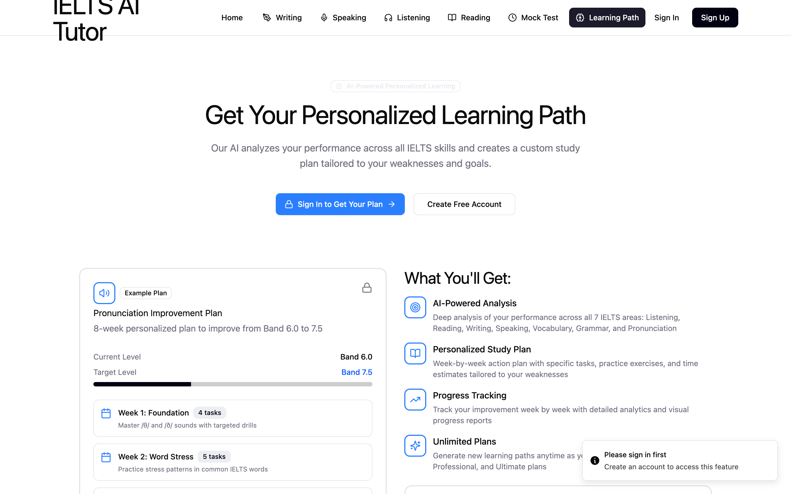
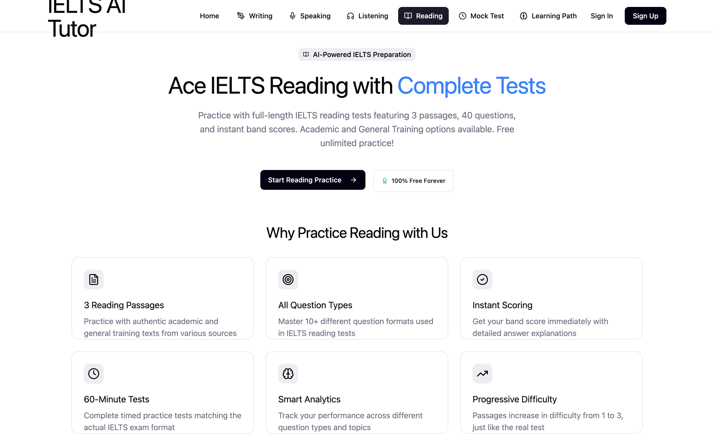

# IELTS AI Tutor — Writing & Speaking practice with instant feedback

> I sat IELTS myself to study in New Zealand. Feedback from tutors took days and cost a lot. This app gives band-score feedback in seconds, on the criteria examiners actually use.

**Role:** product design + build · **Period:** 2026 · **Status:** full UI complete; AI feedback via OpenAI / Azure Speech; payment flows designed

---

## 1. What it does
- **Writing Task 1 & 2** — paste or type an essay, get scores on the 6 official criteria and highlighted errors across **19 error types**, each with an explanation and a corrected version
- **Speaking** — record answers to real Part 1–3 questions; transcription + fluency, pronunciation and lexical feedback
- **Guided drills** — paraphrasing, thesis statements, introductions, body paragraphs, conclusions, each with a timer
- **Listening & Reading** mock tests with scoring
- **Learning path** and progress tracking; subscription plans with local (QPay) and international (card, Apple/Google Pay, PayPal, WeChat, Alipay) payment screens

## 2. Screenshots
| | |
|---|---|
|  |  |
|  |  |
|  |  |

## 3. Design decisions
- Feedback always shows **all** errors, never a sample — learners asked for completeness over brevity
- Error types are colour-coded consistently across writing and speaking
- The UI was designed in Figma first, then generated and refined in code

## 4. Stack
React 18 · TypeScript · Vite · Radix UI · Tailwind · Recharts · OpenAI API · Azure Speech · n8n webhooks

---
*Source code is private. Live walkthrough available on request.* · Licence: CC BY-NC-ND 4.0
