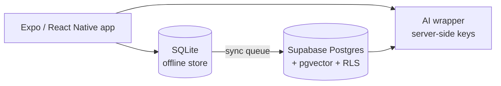
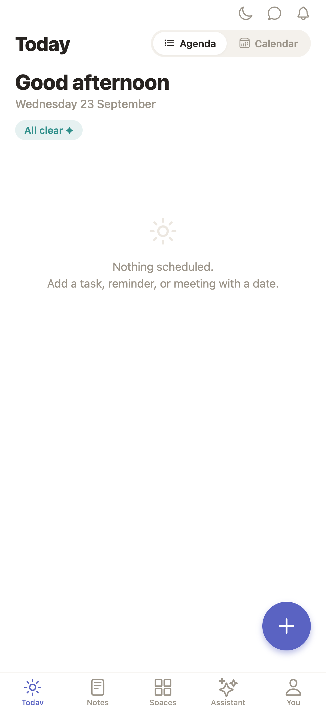
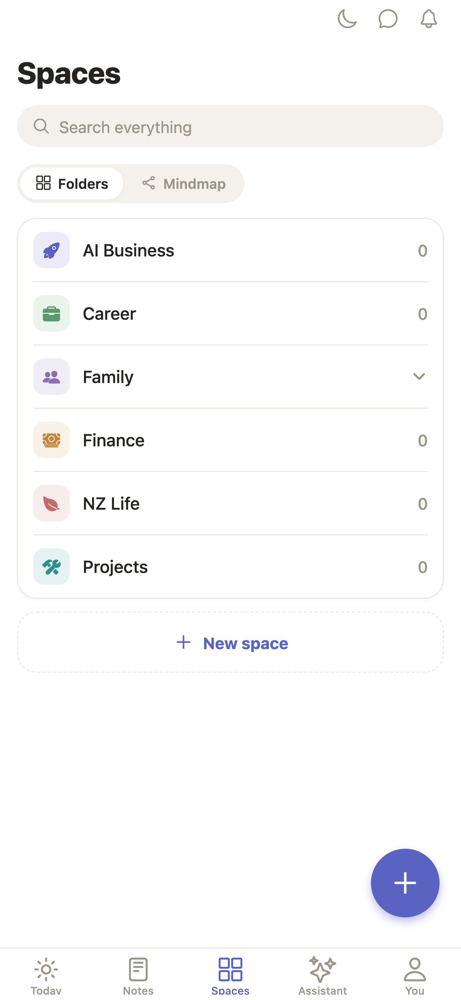
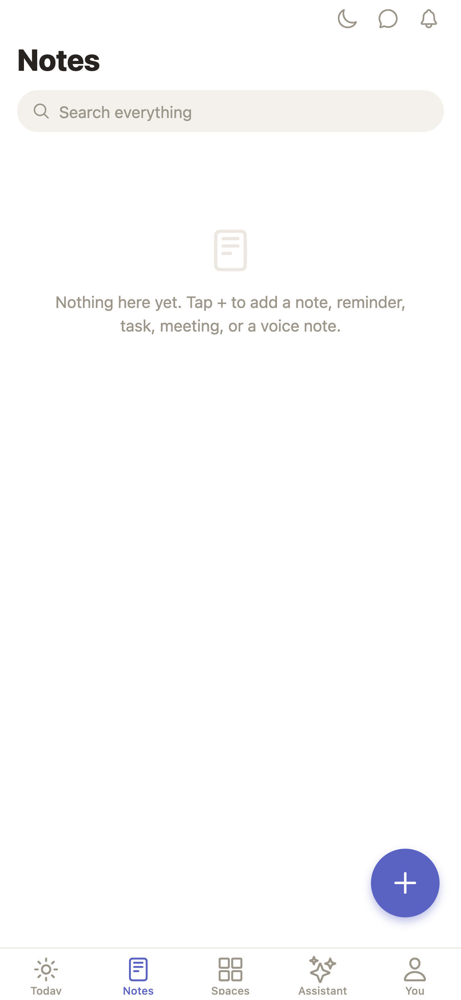
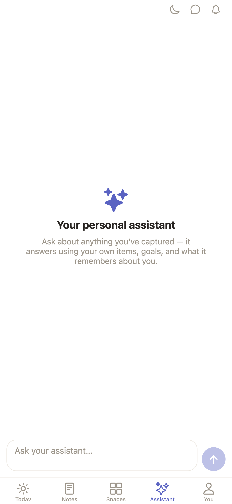
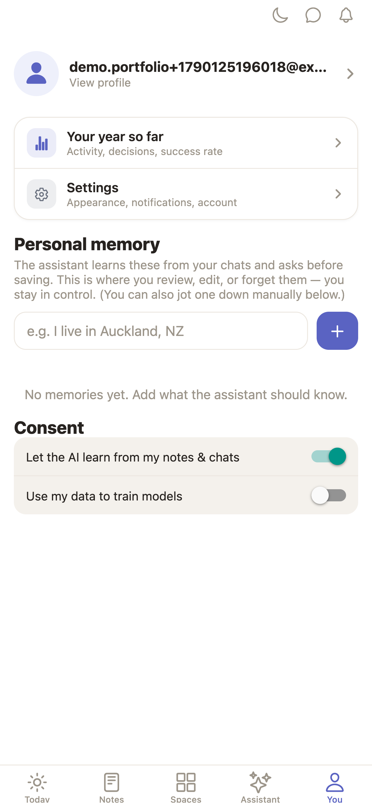
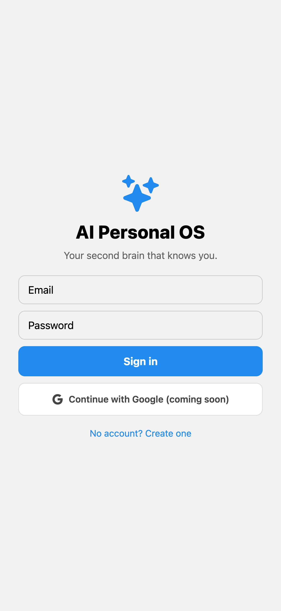

# Life OS — an AI "personal operating system" for mobile

> One loop for everything in life: **Capture → Organise → Store → Research → Plan → Execute → Track.** A second brain plus a proactive assistant, offline-first.

**Role:** product design + build · **Period:** Aug – Sep 2026 · **Status:** MVP screens complete (Sprints 0–3); paused to focus on VoiceOS

---

## 1. What it does
- **Capture** anything in one tap — text, voice, photo, link — and let the assistant file it
- **Spaces** — hierarchical areas of life (work, study, family, visa…) with items, tasks and notes
- **Today** — the assistant's daily plan from your tasks, calendar and habits
- **Assistant** — chat over your own data (semantic search with pgvector)
- **You** — profile, goals, review

## 2. Architecture

- Works fully offline; a durable sync queue reconciles with Supabase when online
- Row-level security so every user only ever sees their own rows
- Model API keys never ship in the app — they stay behind a server-side wrapper

## 3. Screenshots
| | |
|---|---|
|  |  |
|  |  |
|  |  |

## 4. Stack
Expo SDK 54 · React Native · TypeScript · expo-router · SQLite · Supabase · pgvector

---
*Source code is private. Live walkthrough available on request.* · Licence: CC BY-NC-ND 4.0
