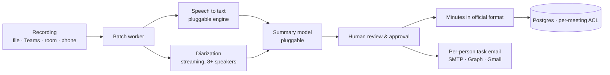

# Meeting Minutes Agent — from recording to signed-off minutes and per-person tasks

> A meeting is recorded in a room, on Teams or over the phone. The system separates who spoke, writes the minutes in the format the organisation actually has to file, extracts each person's action items, and emails every attendee only their own tasks.

**Role:** solo — research, product decisions, build · **Period:** Sep – Oct 2026 · **Status:** shipped to production October 2026

---

## 1. The problem

Someone always takes the minutes. In a committee that files formal resolutions, that person spends the meeting typing instead of contributing, then another hour afterwards reconstructing who agreed to what. Action items are lost between the document and the people who owe them.

Generic transcription tools do not solve this in Mongolia: no Mongolian speech recognition worth using, no support for the official minute format, and in a bank the recording cannot be uploaded to a foreign service.

## 2. What it does

- **Any source.** Uploaded file, Microsoft Teams, live in-room capture, or a phone bridge.
- **Who said what.** Streaming diarization identifies speakers; beyond eight speakers it falls back to a longer window with speaker-embedding clustering. Known voices can be matched to names with stored voiceprints.
- **Minutes in the required format.** Supports the official committee protocol structure as well as a traditional variant, selectable per organisation.
- **Per-person action items.** Each attendee receives an email with only their own tasks, not the whole document.
- **Review before it counts.** Summaries are editable, and nothing is final until a human approves it.
- **Committees, search and briefing.** Meetings group into committees, transcripts are searchable, and a brief can be generated across a series.

**One rule the AI never breaks:** it never writes a decision, a motion or a resolution. Those are what the organisation is legally accountable for, so a human fills them in. The AI drafts everything around them.

## 3. Architecture decisions

- **Built inside the existing console, not as a separate product.** It reuses authentication, roles, tenancy and the integrations hub.
- **Its own data model.** Meetings deliberately do not reuse the call tables; the two have different lifecycles and different access rules.
- **A new "participant" role.** Rank-one access that can reach meetings and nothing else, so attendees can be given a login without exposing the rest of the platform. Every meeting also carries its own access control list.
- **Pluggable engines.** Speech-to-text and summarisation are selected per organisation from a model registry, because the compliance answer differs by customer: some can use a cloud model, others must stay on-premises.
- **One mail gateway.** Every outbound email goes through a single sender with pluggable providers, rather than three code paths that drift apart.

## 4. Delivery

Built in two waves and shipped to production in October 2026: core capture, transcription, summary and mail first, then committees, Teams and mail integrations, voiceprints, retention, search and briefing.

| | |
|---|---|
| Automated tests | 2,388 passing, lint and security scan clean |
| Deployment | 47 files, checksum-verified, with a pre-deploy backup of every replaced file |
| Migrations | Applied on application startup rather than by direct database access |

A bug found during this work is worth recording: a meeting list was filtering by owner instead of by access control list, so a shared meeting could be invisible to someone who was granted access. It was caught by a role-policy test, not by clicking around.

## 5. Why it is defensible

Mongolian language support, on-premises operation, the official protocol format and per-person task email exist individually in other tools. Nothing on the market does all four together, and the first two are the hard ones.

## 6. Stack

Python · FastAPI · PostgreSQL · Nemotron streaming diarization · Whisper · pluggable LLM providers · Microsoft Graph · SMTP · ffmpeg

---
*Source code is private. Live walkthrough available on request.* · Licence: CC BY-NC-ND 4.0
