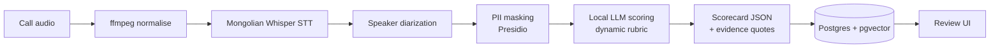

# Voice QA Pipeline — Score 100% of Calls, Not 1–3%

> Quality teams listen to a tiny sample of calls. This pipeline turns every recording into a structured scorecard — on-premises, with personal data masked.

**Role:** solo builder · **Period:** Jun – Jul 2026 · **Status:** working POC on cloud GPU; designed to move to a bank's on-prem DGX servers by changing only `.env`

---

## 1. The problem
A contact centre with tens of thousands of calls a month reviews 1–3% of them by hand. Coaching is late, inconsistent and based on anecdotes. Cloud speech APIs are not an option: recordings contain personal and financial data that must stay in the country.

## 2. What I built

- **Batch pipeline** — processes recordings end to end; each stage independently retryable
- **Dynamic rubric** — QA criteria live in the database, so the business changes scoring without a deploy
- **Evidence** — every score cites the transcript line it is based on; reviewers can correct scores, and corrections feed a knowledge base for future prompts
- **Platform** — FastAPI backend, Postgres + pgvector, Ollama-served open LLM (Qwen family), React review UI, Docker Compose

## 3. Hard problems I solved
- **Mongolian STT accuracy** — benchmarked several Whisper variants and fine-tuned on Mongolian speech
- **Who said what** — diarization tuned for two-speaker phone audio
- **Local LLM choice** — compared Qwen3 models locally vs NVIDIA NIM for Mongolian comprehension (see the LLM benchmark project)

## 4. Results
- 100% of calls scored automatically with consistent criteria
- Zero audio or text leaves the organisation's network
- Human review effort moves from *listening* to *validating*

## 5. Stack
Python · FastAPI · ffmpeg · Whisper · pyannote · Microsoft Presidio · Ollama · Qwen · PostgreSQL + pgvector · React · Docker

---
*Source code is private. Live walkthrough available on request.* · Licence: CC BY-NC-ND 4.0
