# VoiceOS — Mongolian AI Voice Agent & CX Platform

> A customer calls a normal phone number. An AI operator answers in Mongolian, understands the request, looks up the customer's data, and resolves it — or hands over to a human. Supervisors watch it live in a console.

**Role:** solo builder (product, architecture, backend, console UI, ML fine-tuning) · **Period:** Jul – Sep 2026 · **Status:** ran in production on a real PSTN number; now on local UAT after the hosting contract ended.

---

## 1. The problem
Mongolian SMEs and banks cannot afford 24/7 phone coverage, and no vendor offers a Mongolian-language voice agent. Off-the-shelf voice AI (Vapi, Retell, ElevenLabs) has no Mongolian STT/TTS and sends audio abroad — which banking regulation does not allow.

## 2. What I built

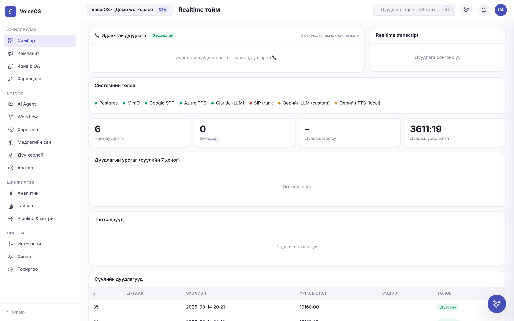

**Telephony chain** — PSTN number → carrier SIP trunk → **Asterisk** → **LiveKit SIP** → Python agent worker (streaming STT → LLM → TTS) with live function calls into the business database.

**Admin console (14 screens, FastAPI + single-page app)**
- Live-call dashboard and call history with full transcripts and audio
- Conversation review with per-turn latency and cost
- Drag-and-drop **workflow canvas** with draft / publish safety
- Hierarchical **RAG knowledge base** (Postgres + pgvector), 590+ documents in production
- Integrations hub: SIP, channels (phone, Messenger, WhatsApp, SMS, web chat), API keys, iPaaS recipes, retention & compliance
- Outbound dialler for reminders and confirmations
- Multi-tenant (row-level security), RBAC, MFA / LDAP, CSP and audit log — hardened to bank security requirements

**Mongolian speech models** — fine-tuned **Whisper** (STT) and **CosyVoice 3** (TTS) on Mongolian data; A/B-tested prosody and speed; speaker-lock filter to ignore background speech.

**Avatar (experimental)** — MuseTalk lip-sync avatar streamed through LiveKit: ~300 ms per frame, 22 fps on a single RTX 4090.

### Architecture
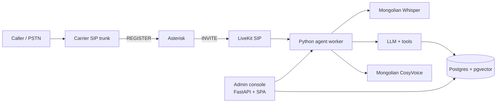

## 3. Hard problems I solved
- **Calls never arrived.** The carrier trunk is registration-based (needs SIP REGISTER) while LiveKit SIP only accepts INVITEs. Placing Asterisk in the middle as the registering endpoint fixed it; also separated RTP port ranges and removed a PJSIP / chan_sip conflict.
- **Background voices.** Family members talking near the phone triggered the agent. Solved with speaker identification and locking onto the first speaker.
- **Data sovereignty.** Everything — STT, LLM, TTS, vectors — runs on servers I control; no audio leaves the country.
- **A partial deploy took production down** once. I now ship config loader, tenancy and main service together, gated by `make lint && make sec`.

## 4. Results
- End-to-end Mongolian voice conversation over a real phone number
- Console covering the full operator/supervisor workflow (14 screens)
- Own STT/TTS models replacing paid APIs — the moat for a local-market product
- Business plan and unit economics written for the Mongolian SME market

## 5. Screenshots
| | |
|---|---|
| 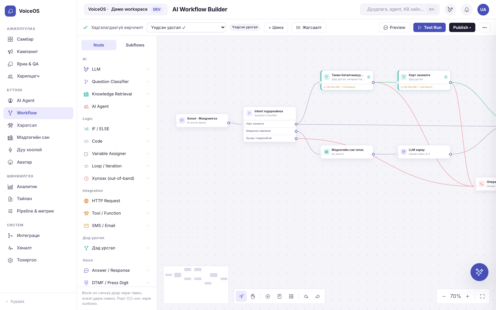 | 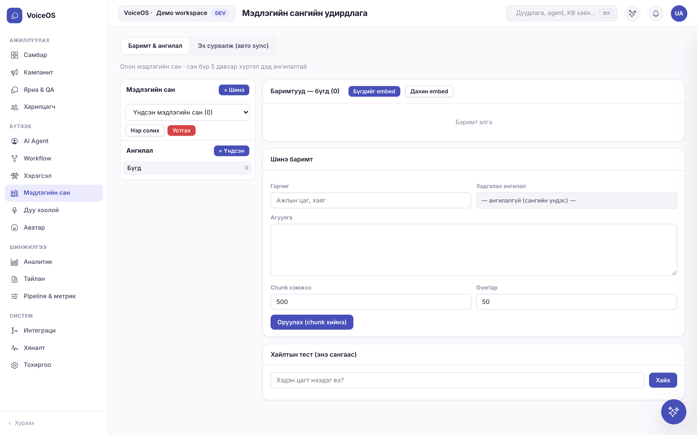 |
| 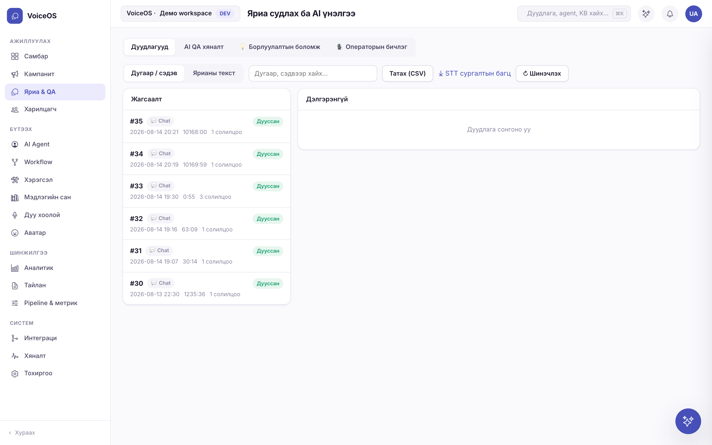 | 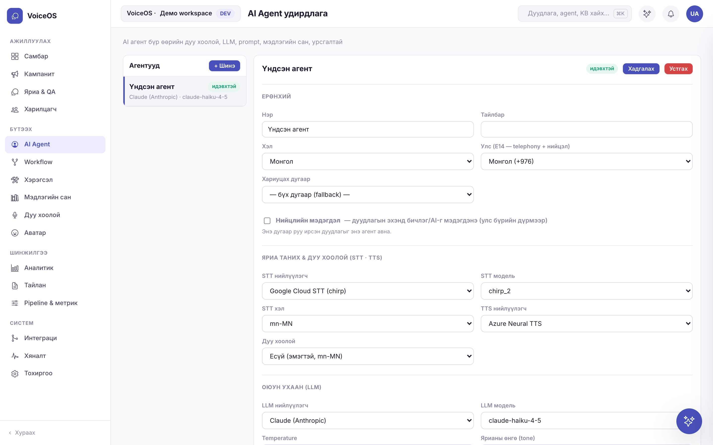 |
| 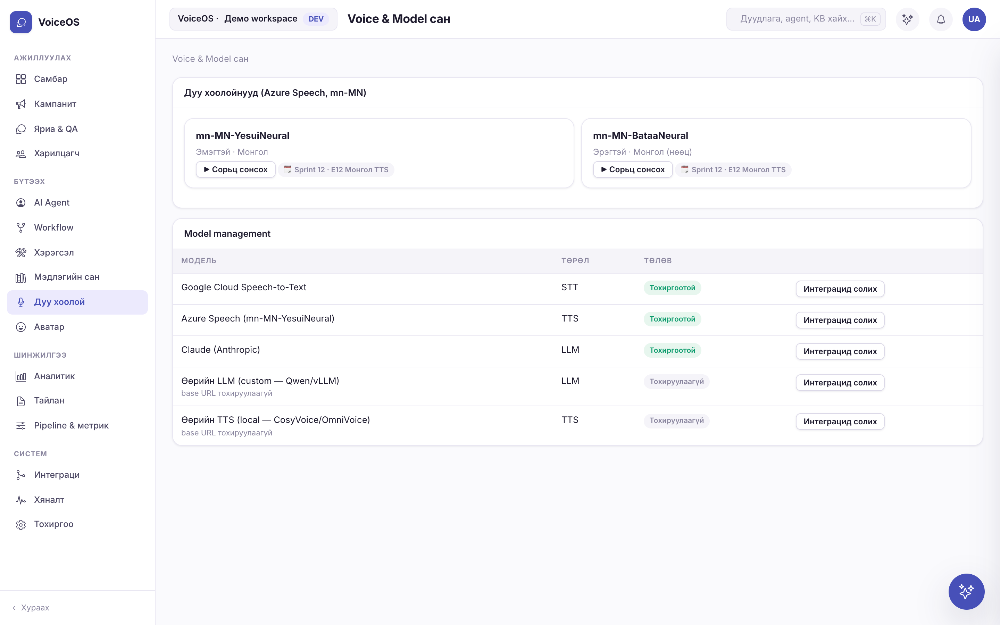 | 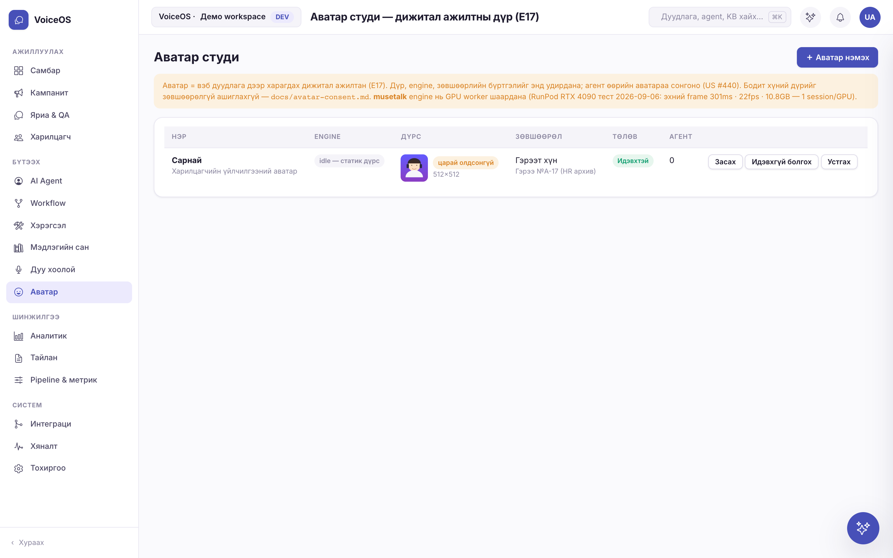 |
| 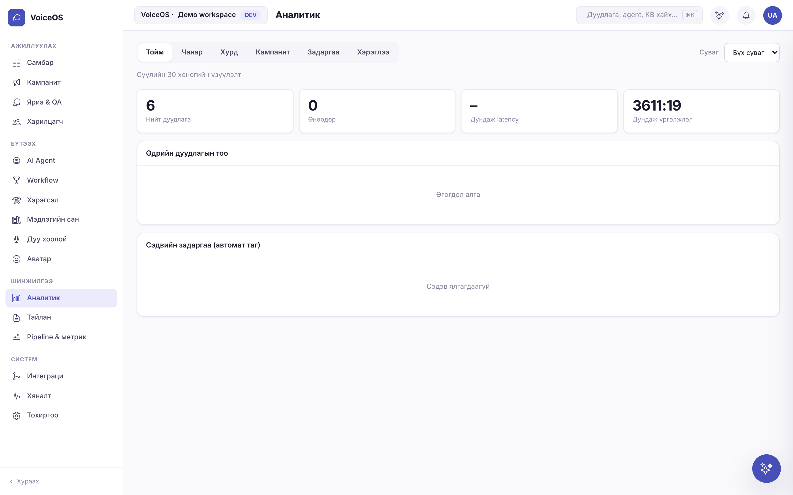 | 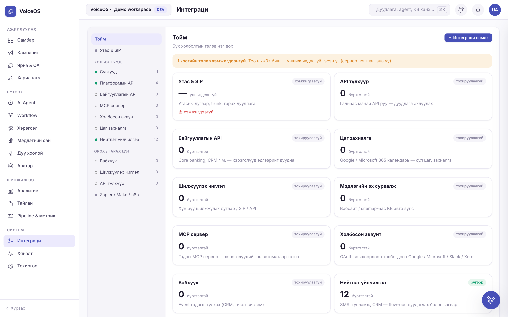 |
| 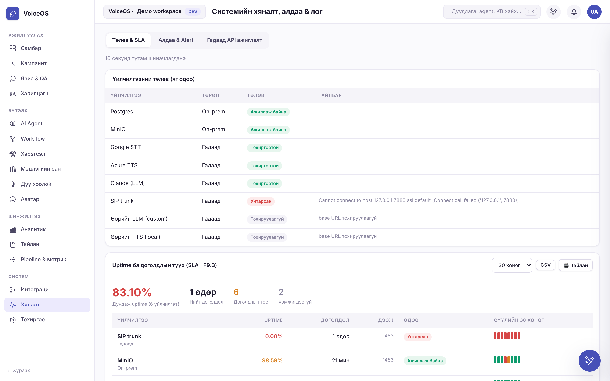 | 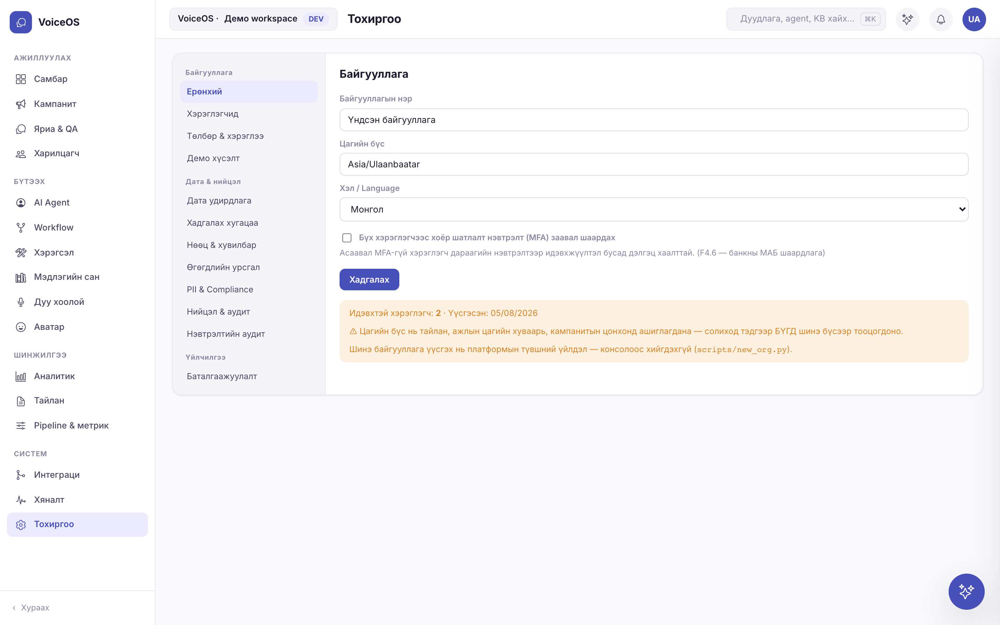 |

## 6. Stack
Asterisk · LiveKit (SIP + agents) · Python · FastAPI · PostgreSQL + pgvector · Redis · MinIO · Docker · RunPod GPUs · Whisper · CosyVoice 3 · MuseTalk · Claude / open-weight LLMs · Azure DevOps boards

---
*Source code is private. Live walkthrough available on request.* · Licence: CC BY-NC-ND 4.0
