# VoiceOS — Mongolian AI Voice Agent & CX Platform

> A customer calls a normal phone number. An AI operator answers in Mongolian, understands the request, looks up the customer's data, and resolves it — or hands over to a human. Supervisors watch it live in a console.

**Role:** solo builder (product, architecture, backend, console UI, ML fine-tuning) · **Period:** Jul 2026 – present · **Status:** live in production on a real phone number

---

## 1. The problem
Mongolian SMEs and banks cannot afford 24/7 phone coverage, and no vendor offers a Mongolian-language voice agent. Off-the-shelf voice AI (Vapi, Retell, ElevenLabs) has no Mongolian STT/TTS and sends audio abroad — which banking regulation does not allow.

## 2. What I built

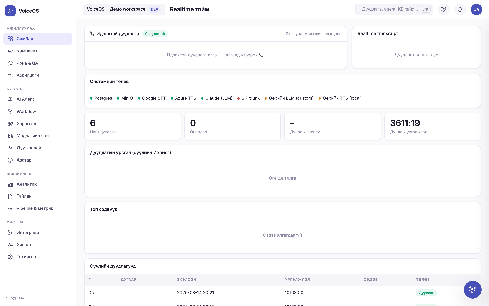

**Telephony chain** — PSTN number → carrier SIP trunk → **Asterisk** → **LiveKit SIP** → Python agent worker (streaming STT → LLM → TTS) with live function calls into the business database.

**Admin console (14 screens, FastAPI + single-page app)**
- Live-call dashboard and call history with full transcripts and audio
- Conversation review with per-turn latency and cost
- Drag-and-drop **workflow canvas** with draft / publish safety
- **Meeting minutes agent** — recordings to official minutes and per-person action emails ([case study](../meeting-minutes/))
- Hierarchical **RAG knowledge base** (Postgres + pgvector), 590+ documents in production
- Integrations hub: SIP, channels (phone, Messenger, WhatsApp, SMS, web chat), API keys, iPaaS recipes, retention & compliance
- Outbound dialler for reminders and confirmations
- Multi-tenant (row-level security), RBAC, MFA / LDAP, CSP and audit log — hardened to bank security requirements

**Mongolian speech models** — fine-tuned **Whisper** (speech to text) and **CosyVoice 3** (text to speech) on Mongolian data, with Kazakh support for the Bayan-Ölgii region. Word error rate on Mongolian drops from 94 to 15 after fine-tuning. Full write-up: [Mongolian Speech Models](../speech-models/).

**Avatar (experimental)** — MuseTalk lip-sync avatar streamed through LiveKit: ~300 ms per frame, 22 fps on a single RTX 4090.

### Architecture
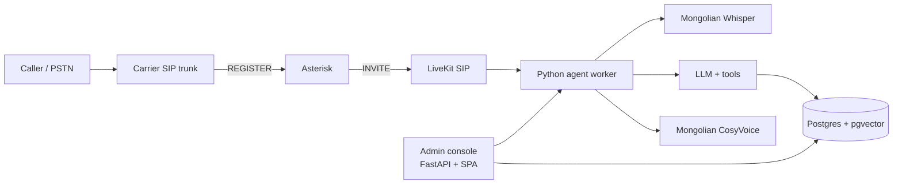
```mermaid
flowchart LR
  PSTN[Caller / PSTN] --> Trunk[Carrier SIP trunk]
  Trunk -->|REGISTER| AST[Asterisk]
  AST -->|INVITE| LK[LiveKit SIP]
  LK --> W[Python agent worker]
  W --> STT[Mongolian Whisper]
  W --> LLM[LLM + tools]
  W --> TTS[Mongolian CosyVoice]
  LLM --> DB[(Postgres + pgvector)]
  C[Admin console<br/>FastAPI + SPA] --> DB
  C --> W
```

## 3. Hard problems I solved

**Calls never arrived.** The carrier trunk is registration-based (it expects a device to SIP REGISTER) while LiveKit SIP only accepts INVITEs. The two never met, so calls failed silently. Putting Asterisk in the middle as the registering endpoint fixed it; I also had to separate RTP port ranges and remove a PJSIP / chan_sip conflict.

**Background voices answered the bot.** A family member talking near the phone would trigger the agent. Solved with streaming diarization that locks onto the caller. Measured on live calls: every piece of background speech rejected, every caller question passed through, median added lag 430 ms.

**Carrier audio that sounded fine but was silent.** One operator's mobile-originated calls arrived with no audio. The cause was a codec and media-timeout mismatch in the distribution's SIP stack, not the application. Now every trunk the console generates is pinned to a single codec and an explicit media timeout.

**Every tenant brings their own phone number.** This is a platform, not one company's deployment, so telephony configuration cannot live in environment files. Organisations connect their own carrier numbers through the console, choose which number each agent uses for inbound and outbound, and the SIP configuration is generated from the database and reloaded — no container restart, no engineer involved.

**Latency is a budget, not a number.** First response is about 7.5 seconds end to end: 1.5 s to detect the caller finished and transcribe, 2.0 s for the language model, 3.4 s to synthesise speech. Knowing the split is what makes it fixable — a spoken filler now starts at about 2.2 s so the caller is never left in silence, and response sentences are synthesised ahead of being needed.

**A partial deploy took production down** once. Config loader, tenancy and the main service now ship together, gated by lint and security checks.

## 4. Results
- End-to-end Mongolian voice conversation over a real phone number, in production
- Console covering the full operator and supervisor workflow, 16 screens
- Multi-tenant: organisations self-serve their own numbers, channels, knowledge bases and AI models
- Own speech models replacing paid APIs — see the [speech models case study](../speech-models/)
- Meeting-minutes agent built on the same platform — see [Meeting Minutes](../meeting-minutes/)
- 2,388 automated tests, lint and security scan gating every deploy
- Business plan and unit economics written for the Mongolian SME market

## 5. Screenshots
| | |
|---|---|
| 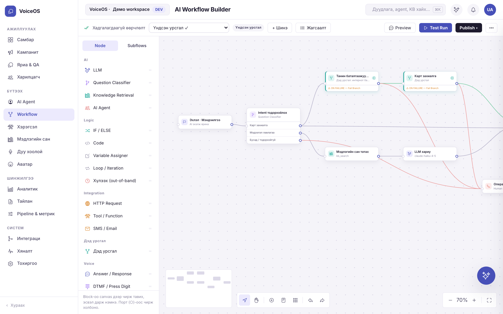 | 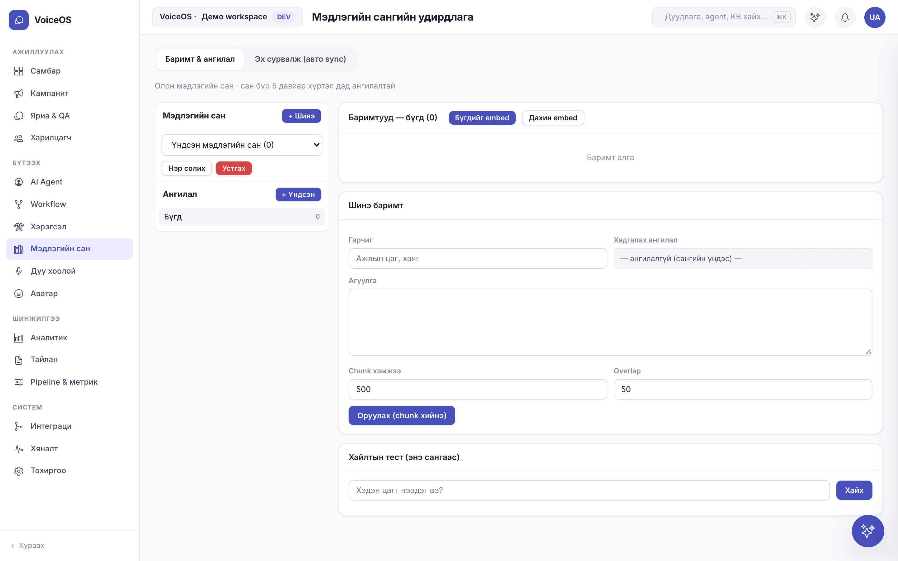 |
| 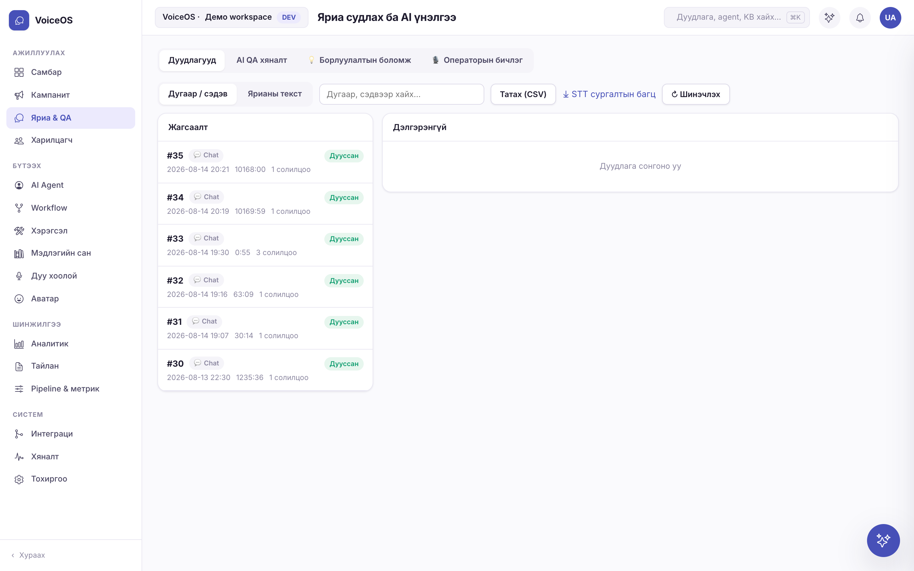 | 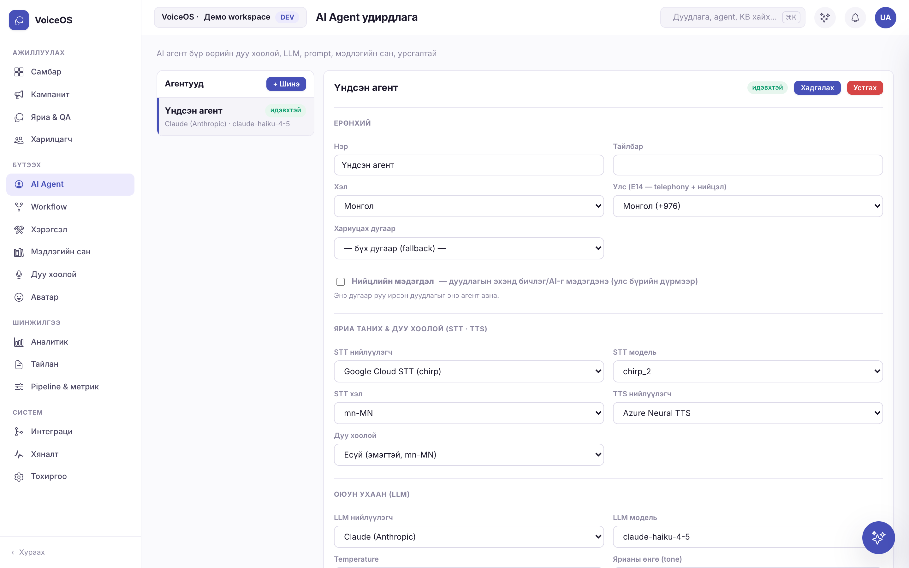 |
| 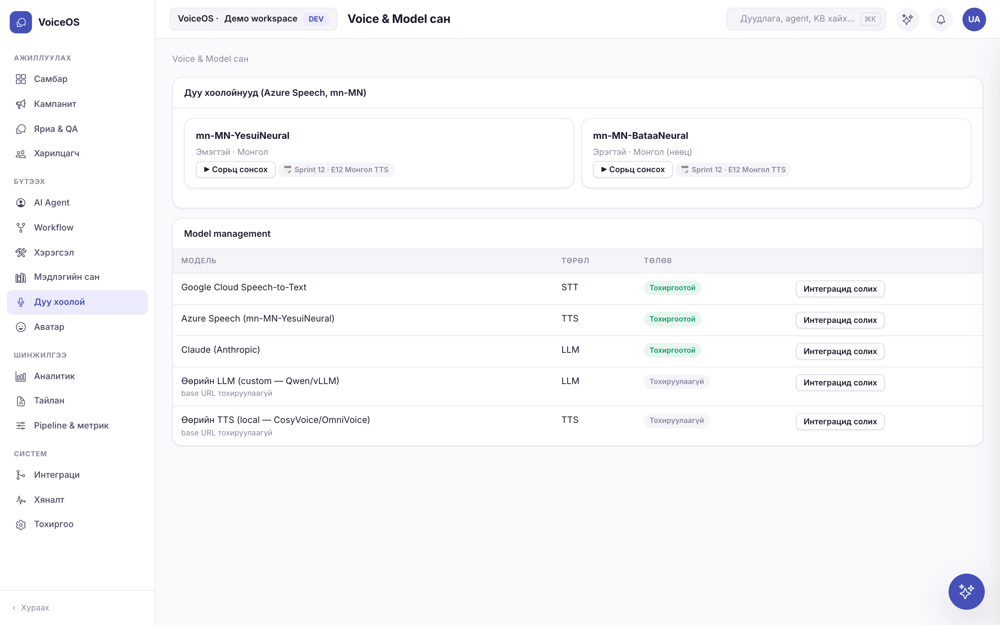 | 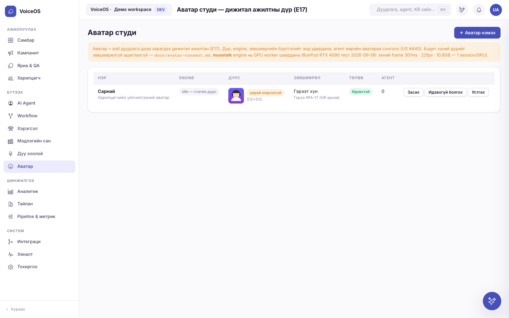 |
| 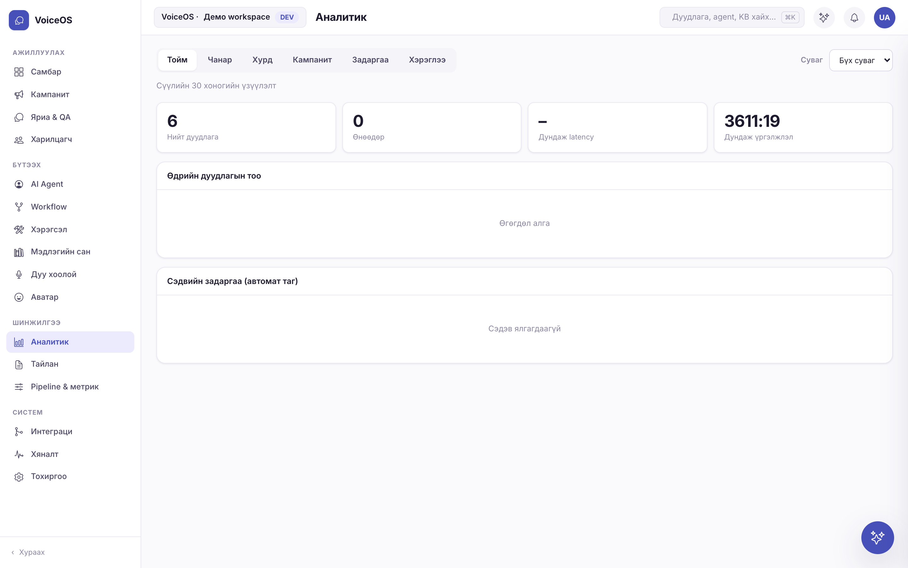 | 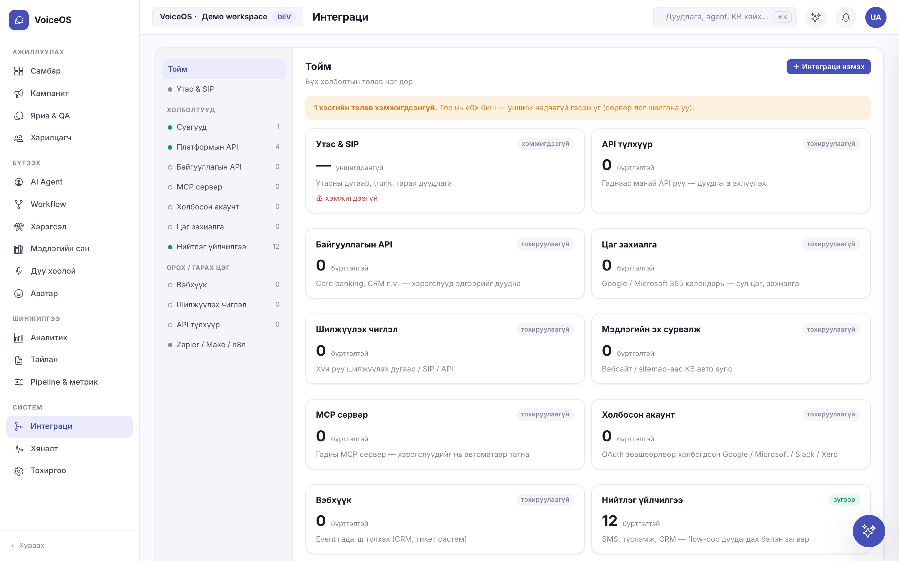 |
| 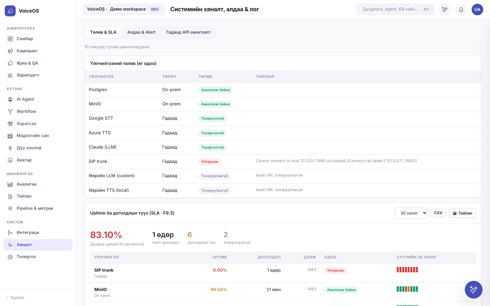 | 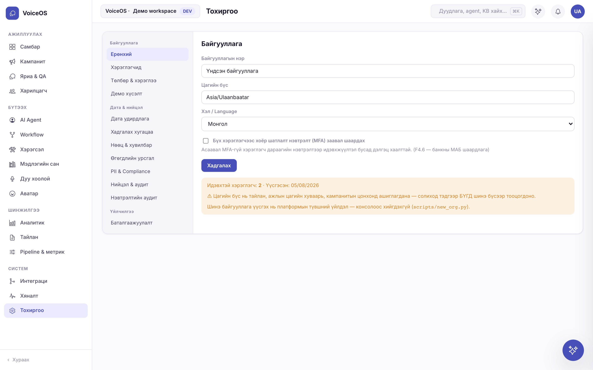 |

## 6. Stack
Asterisk · LiveKit (SIP + agents) · Python · FastAPI · PostgreSQL + pgvector · Redis · MinIO · Docker · RunPod GPUs · Whisper · CosyVoice 3 · MuseTalk · Claude / open-weight LLMs · Azure DevOps boards

---
*Source code is private. Live walkthrough available on request.* · Licence: CC BY-NC-ND 4.0
