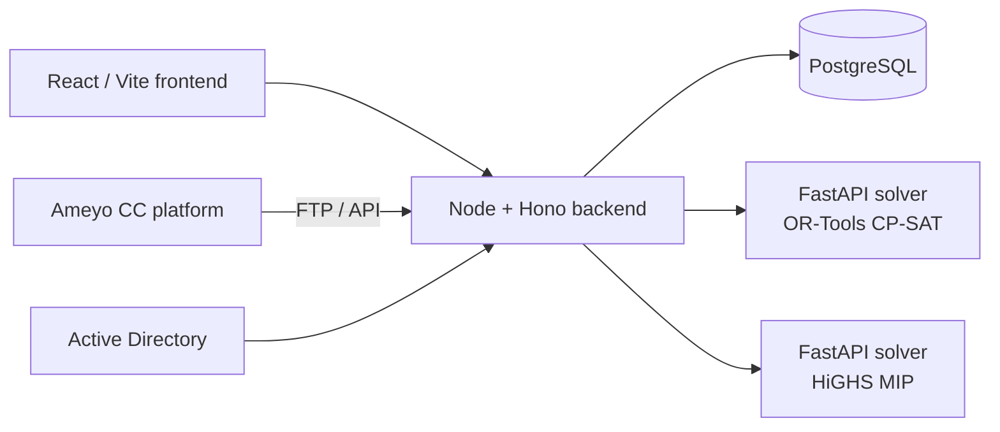
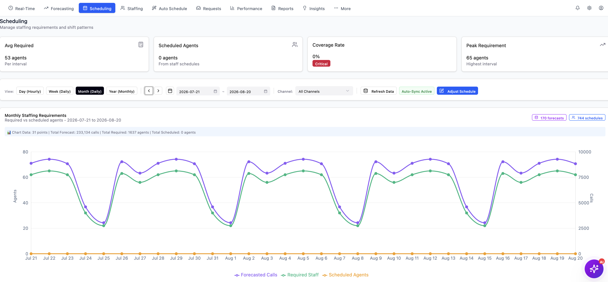
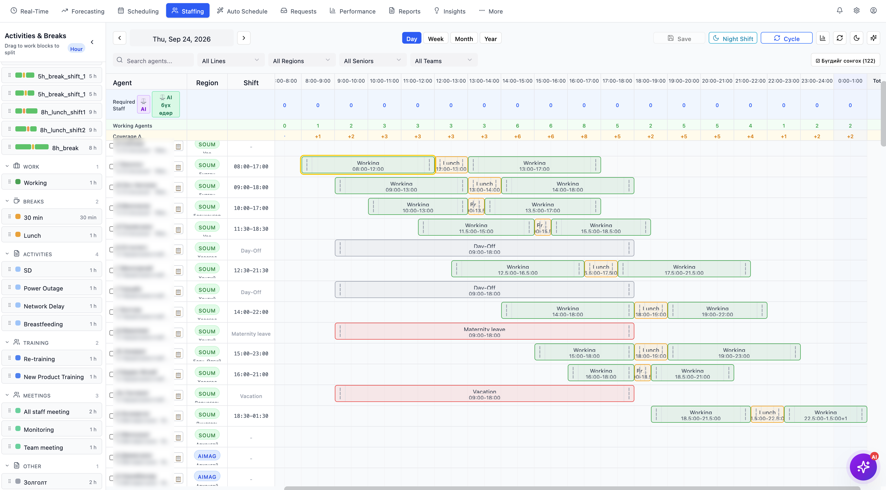
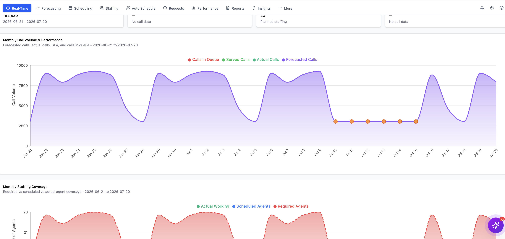
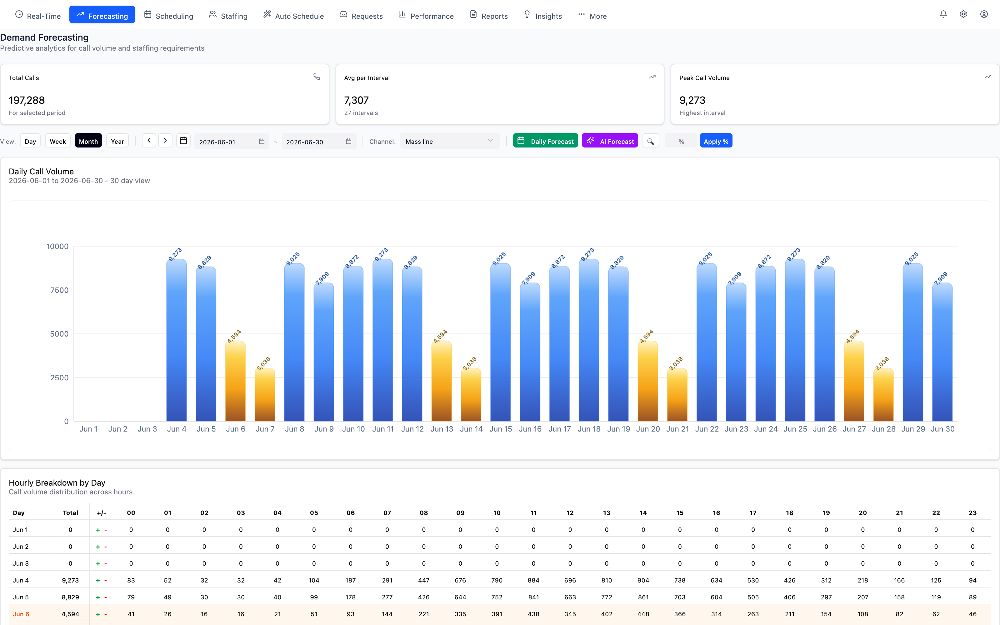
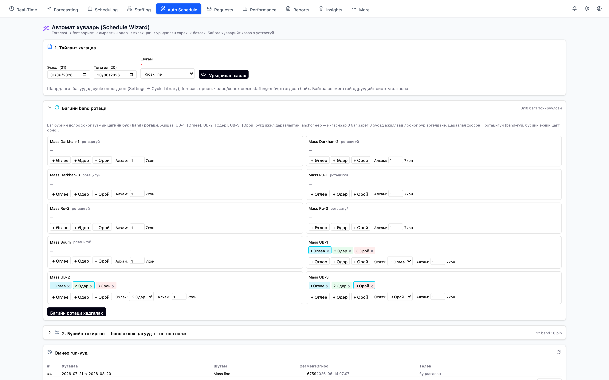
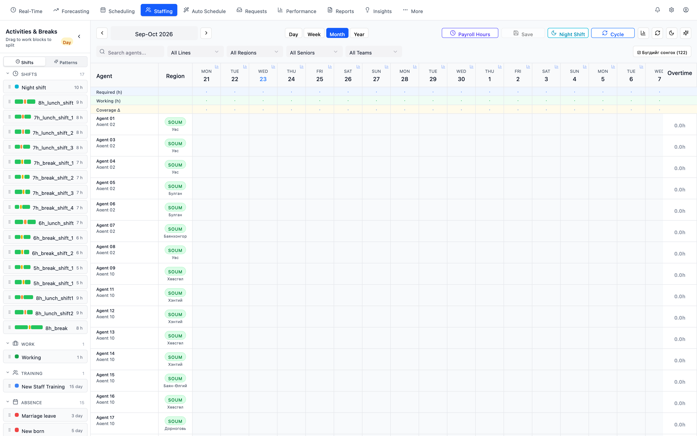
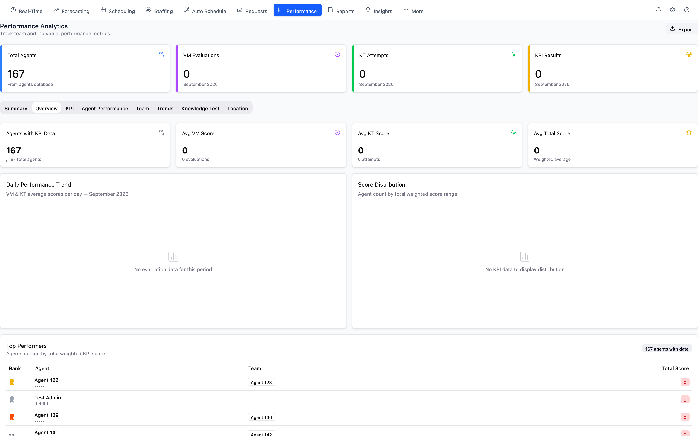
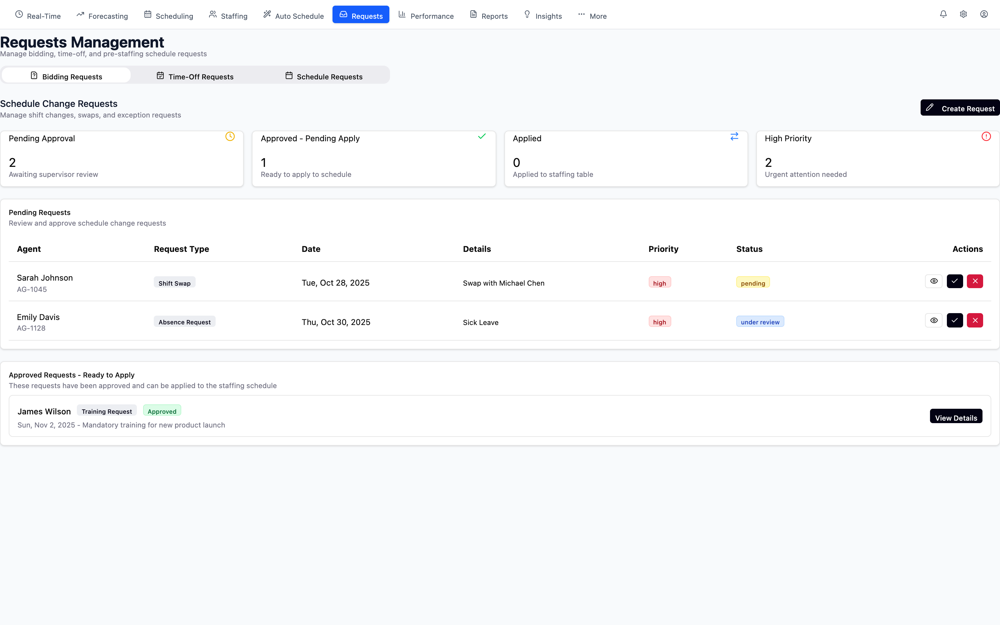
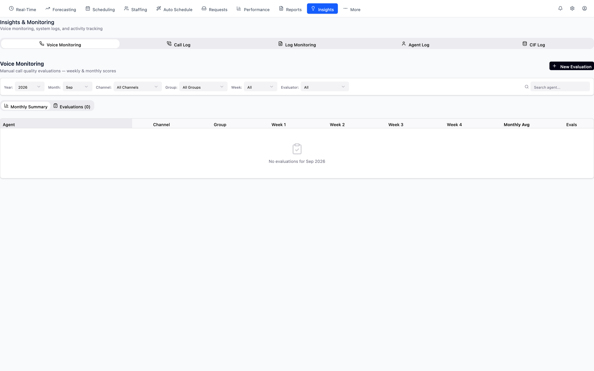

# Contact Centre WFM — Forecasting & Shift Scheduling with Constraint Optimisation

> Fifteen years of building rosters in Excel, turned into software: forecast the calls, then let a solver build a legal, fair, fully-covered schedule in minutes.

**Role:** product owner + builder · **Period:** Mar – Jul 2026 · **Version:** 9.7 · **Status:** working with real contact-centre data (LDAP login, Ameyo integration)

---

## 1. The problem
A national contact centre with hundreds of agents schedules shifts by hand. Every month the WFM team spends days balancing coverage, labour-law limits, night-shift rotation, leave and skill mix — and still under- or over-staffs intervals. Commercial WFM suites cost six figures and do not fit local rules.

## 2. What I built
- **Forecasting** — half-hour call volume and AHT forecast, Erlang-C based staffing requirement per interval
- **Schedule Wizard** — one flow from requirement → shift patterns → assigned agents → published roster
- **Solver** — Google **OR-Tools CP-SAT** (primary) and **HiGHS MIP** (experimental) find schedules that satisfy hard constraints (coverage, max hours, rest between shifts, night-shift rotation, approved leave) and optimise soft ones (fairness, preferences, cost)
- **Pattern library** — reusable shift templates; day-adjust and hour-borrow tools for last-minute changes
- **Real-time** — agent state and queue stats from the Ameyo contact-centre platform via FTP/API feeds
- **Governance** — LDAP/AD login, role-based access, audit log, KPI and CSAT views

### Architecture

## 3. Hard problems I solved
- **Infeasible rosters.** Early models produced "no solution" with no explanation. I added violation/failure reporting so planners see *which* constraint blocks a schedule and can relax it.
- **Solver run time.** Hybrid approach: CP-SAT for the assignment core, heuristics for pre-filling, time-boxed searches with best-so-far results.
- **Trust.** Planners will not adopt a black box. Every generated schedule shows coverage vs requirement per interval and a fairness summary.

## 4. Results
- Roster generation for a full month in minutes instead of days
- Coverage matched to forecast at half-hour granularity
- Documented solver for management sign-off (`solver_doc`, v9.7)

## 5. Screenshots
Staff names and employee IDs in these screenshots are replaced with pseudonyms; the underlying data is not public.

**Required vs scheduled coverage** — a month of forecast demand (233,134 calls) against staffed agents, half-hour granularity. Coverage gaps are flagged before the roster is published.

**Day view: shifts, breaks and absences on one timeline** — each agent's working blocks, lunch, short breaks, day-offs, maternity leave and vacation, with required vs working headcount per hour along the top.

**Real-time: call volume vs staffing** — forecast, actual, served and queued calls against required, scheduled and actually-working agents.

| | |
|---|---|
|  |  |
|  |  |
|  |  |

## 6. Stack
React 18 · TypeScript · Vite · Tailwind · Node.js · Hono · PostgreSQL 16 · Python · FastAPI · OR-Tools CP-SAT · HiGHS · LDAP

---
*Source code is private. Live walkthrough available on request.* · Licence: CC BY-NC-ND 4.0
